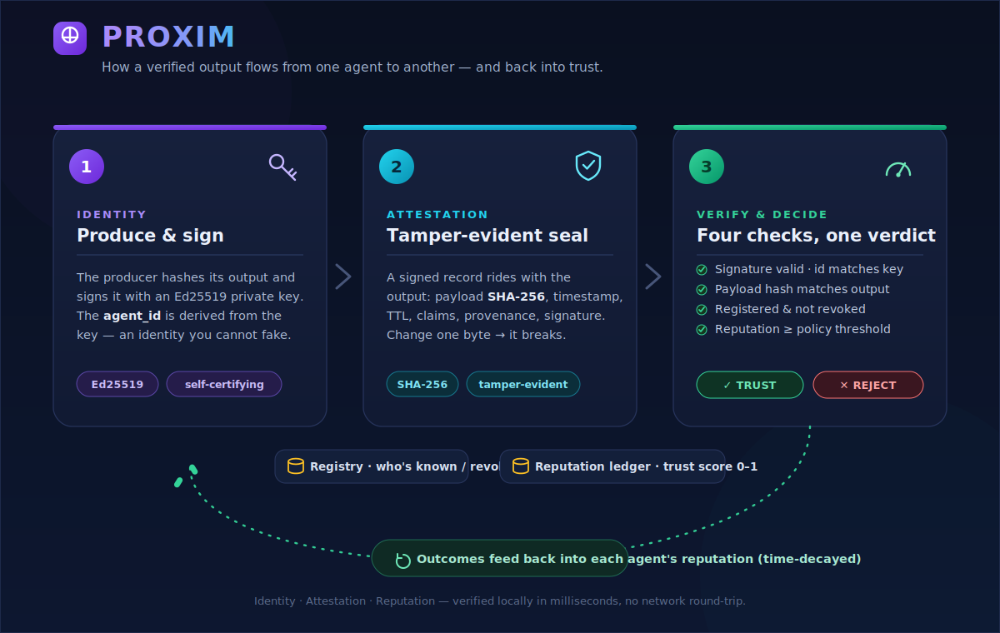

<p align="center">
  
</p>

<p align="center">
  <b>Trust infrastructure for AI agents.</b>
</p>

---

## What is Proxim?

Modern AI systems aren't single models anymore they're pipelines of agents calling other agents, often across teams, vendors, and frameworks. The moment one agent depends on another's output, a question appears that nobody has answered:

**How does an agent decide whether to trust another agent's response?**

Right now, the answer is: it doesn't. It just uses the output and hopes for the best. One degraded, drifted, or impersonated agent quietly poisons everything downstream and there's no way to tell after the fact which link in the chain failed.

Proxim fixes that.

It gives every agent a verifiable identity, attaches a tamper-evident record to every output, and keeps a running reputation for each agent based on how its outputs have held up over time. Before an agent acts on another's response, it can check automatically, in milliseconds whether that response came from who it claims to, and whether that source has earned the right to be trusted.

HTTPS did this for websites. OAuth did this for users. Proxim does it for AI-to-AI communication.

## Who it's for

Anyone building multi-agent systems where outputs flow between agents without a human in the loop: agent orchestration pipelines, autonomous workflows, agent marketplaces, cross-organization AI integrations. If your agents talk to other agents, Proxim gives them a way to talk *carefully*.

## How it works

One agent produces a signed output; another verifies it across four dimensions before acting, then feeds the result back into reputation:

<p align="center">
  
</p>

Proxim rests on three pillars, each mapping to one of the questions above.

| Pillar | Question it answers | Mechanism |
| --- | --- | --- |
| **Identity** | *Who is this agent?* | Every agent holds an Ed25519 keypair. Its `agent_id` is derived from its public key (`px_…`), so the id is **self-certifying** — you cannot claim an id you don't hold the key for. |
| **Attestation** | *Did this output really come from them, unaltered?* | Each output ships with a signed, tamper-evident record: the output's SHA-256, a timestamp, optional claims, and a provenance chain. Change one byte and the signature breaks. |
| **Reputation** | *Has this agent earned my trust?* | Consumers record how each output held up. A time-decayed, Bayesian score in `[0,1]` summarizes the history — new agents start neutral, recent evidence outweighs old. |

A **verifier** checks an incoming attestation against a **registry** (the trust directory — who's known, who's revoked) and the reputation ledger, and a **trust policy** turns the findings into a yes/no **decision** — all locally, in milliseconds, with no network round-trip (the public key travels inside the attestation).

## Install

```bash
pip install -e .          # from a clone; requires Python 3.9+ and `cryptography`
```

## Quickstart

```python
import proxim
from proxim import ProximAgent, InMemoryRegistry, ReputationLedger

# A shared registry + ledger model one trust domain.
registry, reputation = InMemoryRegistry(), ReputationLedger()
alice = ProximAgent.create("alice", registry=registry, reputation=reputation)
bob   = ProximAgent.create("bob",   registry=registry, reputation=reputation)

# Alice produces an output and attests it.
output = b'{"recommendation": "approve"}'
att = alice.attest(output, payload_type="application/json", claims={"model": "opus-4.8"})

# Bob verifies identity + integrity + reputation before acting.
decision = bob.trust(att, output)
assert decision.trusted

# Bob acted, it held up — feedback raises Alice's reputation.
bob.give_feedback(att, proxim.GOOD)
```

Proxim automatically rejects a **tampered output** (hash mismatch), an **impersonator** (id doesn't match the signing key), a **revoked agent**, an **expired** attestation, and an agent whose **reputation** has fallen below policy. See [`examples/`](examples/) for runnable demos of each.

## CLI

```bash
proxim keygen --name signer -o id.json     # create an identity
proxim attest id.json -p output.bin -o att.json   # sign an output
proxim verify att.json -p output.bin       # verify (exit 0 = valid, 1 = invalid)
```

## Architecture

```
proxim/
  crypto.py        Ed25519 + hashing + base64url + agent-id fingerprints
  identity.py      AgentIdentity (signs) / PublicIdentity (verifies)
  attestation.py   the signed, tamper-evident output envelope
  registry.py      trust directory (in-memory + JSON-file backed)
  reputation.py    time-decayed Bayesian reputation ledger
  policy.py        TrustPolicy -> TrustDecision (the thresholds)
  verifier.py      gathers facts, applies policy
  agent.py         ProximAgent — the ergonomic all-in-one handle
  cli.py           the `proxim` command
```

See [`SPEC.md`](SPEC.md) for the wire format of identities and attestations.

## Development

```bash
pip install -e ".[dev]"
pytest            # 54 tests across crypto, identity, attestation, registry,
                  # reputation, policy/verifier, and end-to-end scenarios
```

## Status

Beta. The protocol design is complete and the reference implementation (this repository) is feature-complete with full test coverage.

## License

See [LICENSE](LICENSE).
