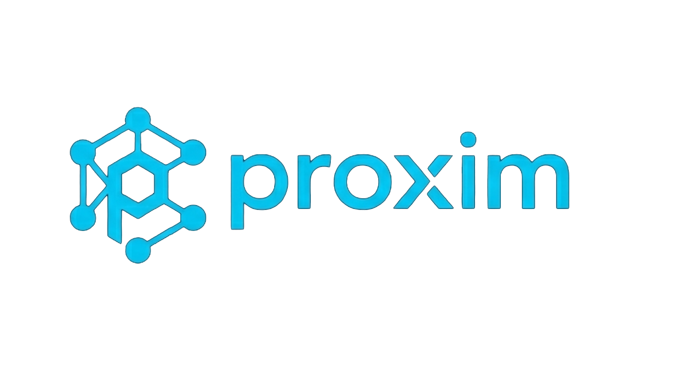

  

  <b>Trust infrastructure for AI agents.</b>

---

## What is Proxim?

Modern AI systems aren't single models anymore — they're pipelines of agents calling other agents, often across teams, vendors, and frameworks. The moment one agent depends on another's output, a question appears that nobody has answered:

**How does an agent decide whether to trust another agent's response?**

Right now, the answer is: it doesn't. It just uses the output and hopes for the best. One degraded, drifted, or impersonated agent quietly poisons everything downstream — and there's no way to tell after the fact which link in the chain failed.

Proxim fixes that.

It gives every agent a verifiable identity, attaches a tamper-evident record to every output, and keeps a running reputation for each agent based on how its outputs have held up over time. Before an agent acts on another's response, it can check — automatically, in milliseconds — whether that response came from who it claims to, and whether that source has earned the right to be trusted.

HTTPS did this for websites. OAuth did this for users. Proxim does it for AI-to-AI communication.

## Who it's for

Anyone building multi-agent systems where outputs flow between agents without a human in the loop: agent orchestration pipelines, autonomous workflows, agent marketplaces, cross-organization AI integrations. If your agents talk to other agents, Proxim gives them a way to talk *carefully*.

## Status

Early development. The protocol design is complete; the reference implementation is in progress.

## License

See [LICENSE](LICENSE).
